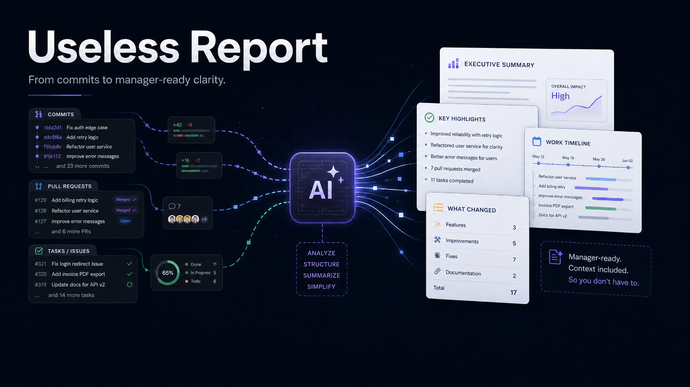
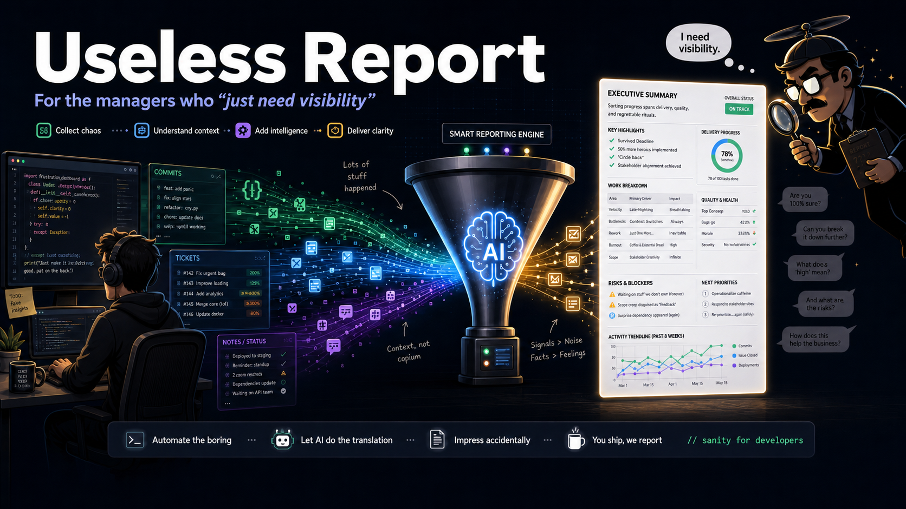
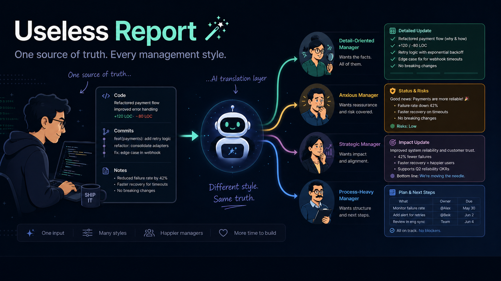
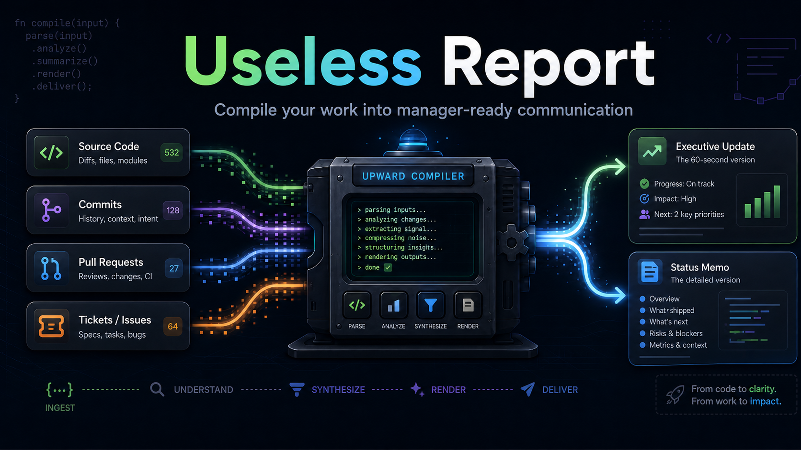

<p align="center">
  
  
</p>
<p align="center">
  
  
</p>

---

# useless-report

### the upward-compiler

*Because "quick update?" never means quick.*

---

Your commits say what changed.
Your tickets say what moved.
**useless-report** says it in the language your manager understands.

---

## What is this?

Most reporting tools answer: **What happened?**

useless-report answers: **How should this be communicated to *this specific person*?**

It reads your real engineering activity — git history, PRs, tickets — and turns it into a manager-adapted report. Same work, different format, depending on who's reading it. Output as markdown, polished HTML, email-ready, or slides.

| Existing tools | useless-report |
|---|---|
| Generate status reports | Generates *audience-adapted* reports |
| Summarize Git / Jira activity | Reframes work for the reader's decision style |
| One generic output | Multiple psychological renderings |
| Markdown only | Markdown, HTML, email, or slides |
| Manual copy-paste | Reads your repo directly |
| One boss | N managers, N reports, one command |

---

## Two core concepts

### Psychological rendering

Same data. Different report. Adapted to the reader.

Like frontend rendering: same data model, different components, different output depending on who's looking. Here: same engineering work, different format, adapted to the manager's decision style, anxiety level, and desired granularity.

### Controlled verbosity

> Never fabricate. Expand only from facts.

The style is adapted. The reality is not. Every sentence in the report must trace back to something real (a commit, a PR, a ticket, an explicit user statement).

---

## Quick start

Install in any git repo, then:

```
/useless-report:weekly-report
```

First run: configures your manager profiles once (saved to `.useless-report/config.yml`).
Every run after: one command, zero questions — generates all reports for all managers.

```yaml
# .useless-report/config.yml — edit freely
period: 7d

managers:
  - name: "Alice"
    profile: control_oriented
    formats: [html, email]
  - name: "Bob"
    profile: risk_sensitive
    formats: [slides]
```

Output:
```
useless-report/2026-05-01/
  alice-control.html
  alice-control-email.html
  bob-risk-deck.md
```

---

## The pipeline

```
   ┌─────────────────────┐
   │  ingest-from-git    │   ← reads git log of current repo
   │  ingest-from-github │   ← gh CLI: PRs, issues, reviews
   │  ingest-from-tickets│   ← extracts JIRA/Linear/GH refs
   └──────────┬──────────┘
              │
              ▼
   ┌─────────────────────────┐
   │ classify-manager-style  │   ← optional: paste manager
   └──────────┬──────────────┘     messages, get a profile
              │
              ▼
   ┌──────────────────────────┐
   │ generate-[archetype]-*   │   ← 10 archetypes × N managers
   └──────────┬───────────────┘
              │
              ▼
   ┌────────────────────────┐
   │ generate-design        │   ← reads DESIGN.md brand tokens
   └──────────┬─────────────┘     or generates one from URL/CSS/screenshot
              │
              ▼
   ┌───────────────────────┐
   │ format-as-html        │   ← branded, email-ready
   │ format-as-email       │   ← CSS inline, Gmail/Outlook safe
   │ format-as-slides      │   ← Marp deck → PDF / PPTX
   │ (default markdown)    │   ← Slack / GitHub / docs
   └───────────────────────┘
```

---

## The 10 manager archetypes

| Skill | Archetype | Alias |
|---|---|---|
| `generate-control-report` | Control-oriented | "Can you send me a quick detailed breakdown?" |
| `generate-risk-report` | Risk-sensitive | "Are we sure about this?" |
| `generate-process-report` | Process-heavy | "Is this in the tracking system?" |
| `generate-stakeholder-brief` | Stakeholder-oriented | "How does this look to the steering committee?" |
| `generate-low-context-digest` | Low-context | "Sorry, catching up — what did we decide?" |
| `generate-volatile-priority-update` | Volatile-priority | "Actually, forget what I said last week" |
| `generate-deadline-reactive-update` | Deadline-reactive | "We need this by tomorrow, right?" |
| `generate-quality-maximalist-report` | Quality-maximalist | "Did we consider all the edge cases?" |
| `generate-ambiguity-tolerant-update` | Ambiguity-tolerant | "Yeah just run with it" |
| `generate-synchronous-first-update` | Synchronous-first | "Let's jump on a call about this" |

Don't know which fits? Run `classify-manager-style` — paste a few of your manager's messages and get a profile in seconds.

---

## All skills (20)

### Ingestion
```
useless-report:ingest-from-git
useless-report:ingest-from-github
useless-report:ingest-from-tickets
```

### Classification
```
useless-report:classify-manager-style
```

### Design
```
useless-report:generate-design        ← DESIGN.md from URL, CSS, screenshot, or nothing
```

### Generation (10 archetypes)
```
useless-report:generate-control-report
useless-report:generate-risk-report
useless-report:generate-process-report
useless-report:generate-stakeholder-brief
useless-report:generate-low-context-digest
useless-report:generate-volatile-priority-update
useless-report:generate-deadline-reactive-update
useless-report:generate-quality-maximalist-report
useless-report:generate-ambiguity-tolerant-update
useless-report:generate-synchronous-first-update
```

### Formatting
```
useless-report:format-as-html          ← branded HTML, DESIGN.md tokens
useless-report:format-as-email         ← CSS inline, Gmail/Outlook safe
useless-report:format-as-slides        ← Marp → PDF / PPTX
```

### CI
```
useless-report:setup-github-action     ← auto-comment on every PR
```

### Orchestration
```
useless-report:weekly-report           ← full pipeline, one command
```

---

## Output formats

| Format | When to use | Output |
|---|---|---|
| **Markdown** | Slack, GitHub comment, docs | `useless-report-[date].md` |
| **HTML** | Polished email, share link, print | `[manager]-[profile].html` |
| **Email** | Copy-paste into Gmail/Outlook | `[manager]-[profile]-email.html` |
| **Slides** | Steering committee, all-hands | `[manager]-[profile]-deck.md` → PDF/PPTX |

All HTML output is **single-file, no external dependencies, no JavaScript**.
Visual identity driven by your project's `DESIGN.md` — [google-labs-code/design.md](https://github.com/google-labs-code/design.md) standard.

---

## Design principle

> This is not a solution to bad management. It is a tactical tool for reducing noise while the real problems get addressed.

The profiles are not diagnoses. They are communication preference maps. The archetypes have funny aliases because the situations are genuinely absurd — but the tool treats people with respect.

---

## Part of the useless-skills family

→ [useless-roulette](https://github.com/bacoco/useless-skills) — absurd skills for Claude Code

---

*Work does not speak for itself. It has to be rendered for its audience.*
