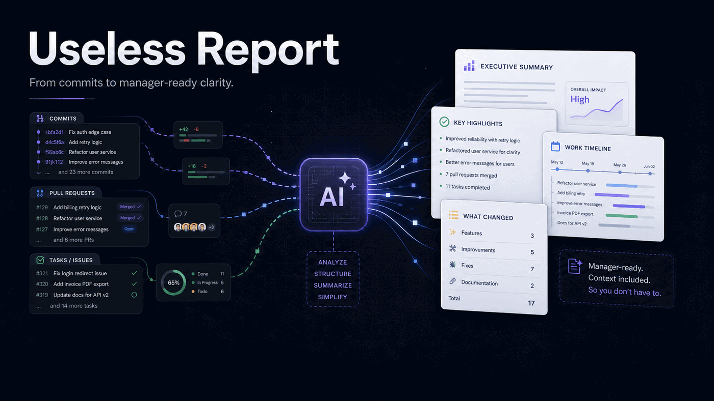

  

<h1 align="center">useless-report</h1>

  <strong>Your work is real. Make sure it reads that way.</strong>

  One command. Your git history. Every manager, covered.

  <a href="#get-started">Get started</a> · <a href="#how-it-works">How it works</a> · <a href="#the-10-archetypes">Archetypes</a> · <a href="#formats">Formats</a> · <a href="#before-the-meeting">Before the meeting</a>

---

## The problem

You shipped. You fixed. You unblocked three people and made a call that saved the quarter.

Then someone asked for "a quick update" — and you spent two hours writing a report nobody read the same way.

**Same week. Ten different managers. Ten different expectations.**

Then came the meeting. They asked questions you didn't see coming. You had the data. You just didn't have it in the right shape for that room.

---

## The fix

useless-report reads your codebase — commits, PRs, tickets — and writes the report *they* want to read.

Not a summary. Not a template. A report adapted to how your manager thinks, decides, and worries.

The report. The Q&A. The call script. All from the same source.

> *"Different style. Same truth."*

---

## One command

In Claude Code, just say it:

> *"Generate my weekly report"*

Set up once. Run forever. No questions after the first time.

---

**One week of work. One run. Everything ready.**

For **Alice** — control-oriented
- Branded HTML report, ready to forward
- Email version, paste directly into Gmail
- Q&A sheet — every question she'll ask, answered
- Call guide — sounds like you, not a template

For **Bob** — risk-sensitive
- Slide deck, export to PDF in one command

And in the background: history saved, open requests tracked.

---

*23 commits read. Nothing invented.*

---

## How it works

<table>
<tr>
<td width="25%" align="center">

**① Read**

Your git log. Your PRs. Your tickets.

*Real data, nothing invented.*

</td>
<td width="25%" align="center">

**② Understand**

Who is reading this? What do they need? How do they decide?

*10 manager archetypes.*

</td>
<td width="25%" align="center">

**③ Generate**

The report they'll actually read. Adapted tone, structure, and level of detail.

*One fact base. N reports.*

</td>
<td width="25%" align="center">

**④ Deliver**

Report. Q&A. Call prep. Your brand. Your voice. One run.

*Ready for anything.*

</td>
</tr>
</table>

---

## The 10 archetypes

Every manager has a pattern. Pick theirs — or let useless-report figure it out.

| | Archetype | What they always say |
|---|---|---|
| 🔬 | **Control-oriented** | *"Can you send a quick detailed breakdown?"* |
| 🛡️ | **Risk-sensitive** | *"Are we sure about this?"* |
| 📋 | **Process-heavy** | *"Is this in the tracking system?"* |
| 🎭 | **Stakeholder-oriented** | *"How does this look to the committee?"* |
| 🌀 | **Low-context** | *"Sorry catching up — what did we decide?"* |
| 🎯 | **Volatile-priority** | *"Actually, forget what I said last week"* |
| ⏰ | **Deadline-reactive** | *"We need this by tomorrow, right?"* |
| 🔍 | **Quality-maximalist** | *"Did we consider all the edge cases?"* |
| 🌊 | **Ambiguity-tolerant** | *"Yeah just run with it"* |
| 📞 | **Synchronous-first** | *"Let's jump on a quick call"* |

Don't know which fits? Just ask:

> *"Help me figure out my manager's communication style"*

---

## Formats

Every report, in the format they'll actually open.

<table>
<tr>
<td align="center" width="25%">

**Markdown**

Slack. GitHub. Notion. Docs.

</td>
<td align="center" width="25%">

**HTML**

One file. Your brand. Email-ready.

</td>
<td align="center" width="25%">

**Email**

Inline CSS. Gmail. Outlook. Copy-paste.

</td>
<td align="center" width="25%">

**Slides**

Marp deck. PDF or PPTX. Steering committee.

</td>
</tr>
</table>

Visual identity driven by your `DESIGN.md` — the [Google Labs open standard](https://github.com/google-labs-code/design.md) for brand tokens. Pass a URL, a CSS file, a screenshot, or nothing — useless-report handles it.

---

## Before the meeting

The report gets you through the week. These get you through the room.

<table>
<tr>
<td align="center" width="33%">

**Q&A Prep**

Every question they'll ask. Answers ready. Danger zones flagged.

*Read it on your phone. Walk in confident.*

</td>
<td align="center" width="33%">

**Call Prep**

Your words. Their language. Your style.

*Not a script. A guide that sounds like you.*

</td>
<td align="center" width="33%">

**History**

What you promised. What they asked. What changed.

*Never lose track of an open request again.*

</td>
</tr>
</table>

Just ask:

> *"Prepare my Q&A for tomorrow's meeting with Alice"*
> *"I have a call with Bob in 20 minutes, help me prepare"*
> *"What did Alice ask me to do last week that's still open?"*

---

## Get started

**Install** — in Claude Code, say:

> *"Install the plugin from github.com/bacoco/useless-report"*

**First run** — from inside any git repo, say:

> *"Generate my weekly report"*

60 seconds to set up. Instant every time after.

**Set up CI** — auto-comment on every PR:

> *"Set up the GitHub Action for useless-report in this repo"*

---

## The fine print

This is not a solution to bad management.

It is a tactical tool for reducing communication friction while the real problems get addressed. The profiles are not diagnoses. The archetypes have funny aliases because the situations are genuinely absurd — but the tool treats everyone with respect.

> *Work does not speak for itself. It has to be rendered for its audience.*

---

  Part of the <a href="https://github.com/bacoco/useless-skills">useless-skills</a> family

